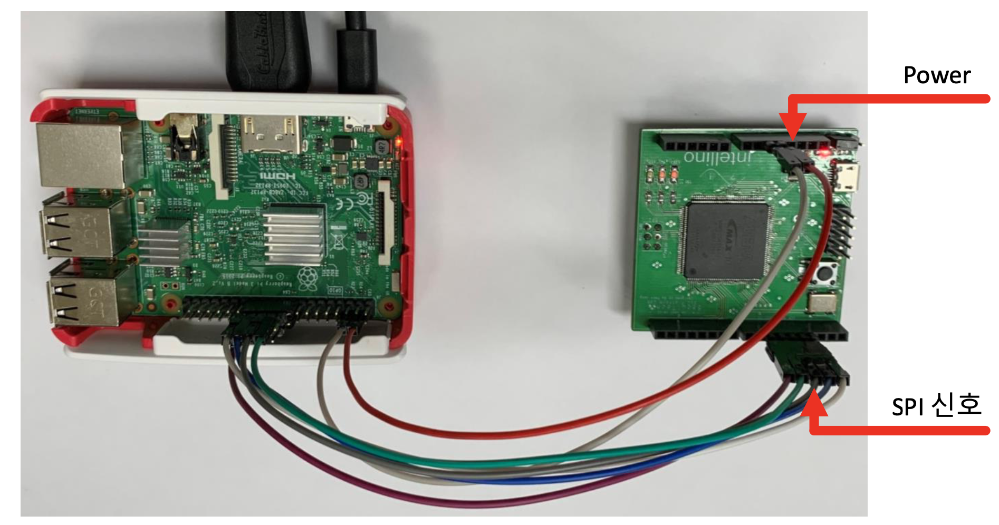

<div align="center">


**The Intellino core logic wrapper for ML simulation with intellino**

</div>

---


<!-- TABLE OF CONTENTS -->

## Table of Contents

*  [About the Project](#about-the-project)
* [Getting Started](#getting-started)
  * [Prerequisites](#prerequisites)
  * [Installation](#installation)

*  [Usage](#usage)

* [License](#license)

* [Contact](#contact)


<!-- ABOUT THE PROJECT -->

##  About The Project





SoC Platform Lab in Seoultech, South Korea made SoC chip called "Intellino". Intellino designed to working AI algorithms like aa classification task.

Sometimes people feels to hard using directly board combined SoC chip. This Project for people as feels hard using board combined SoC chip support simulation built using python


<!-- GETTING STARTED -->

## Getting Started

Intellino package can install from PyPi simply


### Prerequisites

- python3.6


### Installation

```sh
pip3 install Intellino
```


<!-- USAGE EXAMPLES -->

## Usage

### MNIST classification

MNIST contains 70,000 images of handwritten digits: 60,000 for training and 10,000 for testing. The images are grayscale, 28x28 pixels. many AI framework use MNIST classification as example code.

```python
import matplotlib.pyplot as plt

from intellino.core.neuron_cell import NeuronCells
from intellino.utils.data.dataloader import DataLoader

from mnist_dataset import MNIST


def test(neuron_cells, is_log=False):
    test_mnist = MNIST(root="./", train=False, download=False)
    test_dataloader = DataLoader(test_mnist, shuffle=True)

    TP = 0
    for idx, (image, target) in enumerate(test_dataloader):

        prediction = neuron_cells.inference(image)

        if target == prediction:
            TP += 1

        if is_log:
            print(f"label-> {target}, prediction-> {prediction}")

    print("Accuracy : {}".format(TP / len(test_mnist)))


def train():
    train_mnist = MNIST(root="./", train=True, download=False)
    train_dataloader = DataLoader(train_mnist, shuffle=True)

    number_of_neuron_cells = 100
    length_of_input_vector = 256
    neuron_cells = NeuronCells(number_of_neuron_cells=number_of_neuron_cells,
                               length_of_input_vector=length_of_input_vector,
                               measure="manhattan")

    print(f"Number of Cells : {len(neuron_cells)}")

    each_clss_distrib = {"0": 0,
                         "1": 0,
                         "2": 0,
                         "3": 0,
                         "4": 0,
                         "5": 0,
                         "6": 0,
                         "7": 0,
                         "8": 0,
                         "9": 0,}

    finish_train = False

    print("Start Training!")
    for idx, (image, target) in enumerate(train_dataloader):
        if finish_train:
            break

        each_clss_distrib[str(target)] += 1
        finish_train = neuron_cells.train(vector=image, target=target)

    print("Done!")
    return neuron_cells


if __name__ == "__main__":
    # Dataset Visualization
    mnist_tets = MNIST(root="./", train=True, download=False)
    image, target = mnist_tets.__getitem__(0)
    image = image.reshape(16, 16)
    plt.figure()
    plt.imshow(image)
    plt.title(str(target))
    plt.show()

    # Train NeuronCells
    neuron_cells = train()
    test(neuron_cells, is_log=False)

```


**NeuronCells**

`NeuronCells` class is core in Intellino. we just focus on here:

- number_of_neuron_cells: Intellino has cells. concept is similar with model in other AI framework like PyTorch, TensorFlow
- length_of_input_vector: cells can split each cell and each cell have data container and data container has limit legnth 

_For more examples, please refer to the [Documentation](https://intellino.readthedocs.io/en/latest/)_


<!-- LICENSE -->

## License

Distributed under the GPL-3.0 License. See `LICENSE` for more information.


<!-- CONTACT -->

## Contact

Martin Hwang - hwangdonghyun@seoultech.ac.kr

 