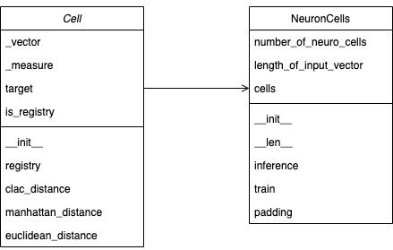
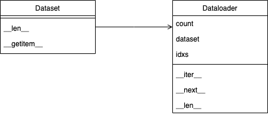

<div align="center">
# 내부 가이드 문서


## Table of Contents

*  [Class Diagram](#Class-Diagram)
* [Source Code](#source-code)
*  [Example](#example)


##  Class Diagram

Intellino 패키지의 구성은 다음과 같다.

- Core
- Trainer
- Utils
  - dataloader
  - dataset


### Core




#### 구조

Core 패키지는 `NeuronCells` 와 `Cell` 클래스 이다. `Cell` 클래스와 `NeuronCells` 클래스는 서로 의존성을 가지며 `NeuronCells` 클래스는 외부 인터페이스 역활을하고 `Cell` 클래스는 실질적인 연산을 담당한다. 실제 범용적으로 상용되고있는 인공지능 프레임워크(TensorFlow, PyTorch, MxNet, CNTK)와 비교했을 경우 `NeuronCells`는 `Model`과 유사한 역활을 한다.

 `Cell` 클래스의 주역활은 다음과 같다.

1. 추론시 입력 벡터와의 거리 계산
2. 학습시 입력 벡터 등록


`NeuronCells` 클래스의 주역활은 다음과 같다.

1. 입력 Cell 개수에 맞춰 `Cell` 인스턴스 생성
2. 학습
3. 추론


### DataLoader & Dataset




#### 구조

DataLoader와 DataSet 클래스는 사용자 정의의 데이터셋과 이를 로딩하는 방법에 대한 추상 클래스로 기존에 정의한 함수를 오버라이딩해서 사용자 정의에 맞춰 재작성해서 사용할 수 있는 구조이다.

DataSet 클래스는 순서가 있는 시퀸셜 데이터 컨테이너이고 [이터레이블](https://en.wikipedia.org/wiki/Iterator)한 속성을 갖는다. DataLoader 클래스는 [이터레이터](https://en.wikipedia.org/wiki/Iterator)이며 [이터레이블](https://en.wikipedia.org/wiki/Iterator)한 속성을 갖는 데이터 컨테이너를 활용하여 데이터를 반복적으로 꺼낼 수 있다. 

즉, DataLoder 클래스는 DataSet 클래스를 입력으로 받아 데이터를 `for`문으로 꺼낼 수 있는 반복자이다. 코드로 표현하면 다음과 같다.

```python
data = Dataset()
dataloader = DataLoader(data)
model = NeuronCells()

for data, target in dataloader:
    model.train(data, target)
```


위 코드는 1). 사용자가 만든 데이터셋 컨테이너를 2). 이터레이터를 이용해서 학습 이미지와 레이블을 꺼내고 3). 모델에 입력으로 줌으로써 모델을 학습시키는 코드이다.


## Source Code


### Core

**`NeuronCells`**

- 객체의 생성자는 int type인 `number_of_neuron_cells`, `length_of_input_vector`, 그리고 string type인 `measure`이라는 변수를 입력받는다.
  - ``number_of_neuron_cells`: 생성할 `Cell`클래스 갯수이다.
  - `length_of_input_vector`: 학습 혹은 추론시 사용할 vector 길이다. 만약 입력받은 vector길이가 초기 정해진 vector 길이보다 적다면 뒷부분을 모두 0으로 채워서 사용한다.(padding)
  - `measure`: 추론시 입력 벡터와 거리를 계산하는 방식을 의미한다. 현재는 L1(Manhattan), L2(Euclidean)을 지원한다.

```python

import numpy as np
from typing import List


class NeuronCells:
    """
    NeuronCell Container for simulate Intellino
    """

    def __init__(self,
                 number_of_neuron_cells: int = 100,
                 length_of_input_vector: int = 196,
                 measure="manhattan") -> None:

        """

        Args:
            number_of_neuron_cells (int): number of neuron cell.
                                          it's corresponding number of Neuron Cell in Intelino hardware
            length_of_input_vector (int): length of vector.
                                          Intellino Hardware has limitation of vector length.
                                          this arguments means limitation of vector length in Intellino Hardware
            measure (str): method of distance measure.
                           default method is "manhattan" in Intellino Hardware

        Returns:
            (None)
        """
        self.number_of_neuro_cells: int = number_of_neuron_cells
        self.length_of_input_vector: int = length_of_input_vector
          
        # Python의 List Comprehension을 활용하여 `Cell`객체를 입력받은 `number_of_neuro_cells`개 만큼 만든다.
        # List Comprehension
        # https://www.pythonforbeginners.com/basics/list-comprehensions-in-python
        self.cells: List = [Cell(self.length_of_input_vector, measure) for _ in range(self.number_of_neuro_cells)]

    # `NeuronCells`의 길이를 측정한다.
    # C언어에서 sizeof와 비슷하다. Matlab에서는 length함수와 비슷하다.
    # Python에서는 객체의 길이를 확인할 수 있는 함수를 커스터마이징할 수 있게 지원하는데
    # 이는 `__len__`이라는 매직메소드를 오버라이딩하면 가능하다.
    def __len__(self):
        return len(self.cells)

    # 추론할 때, 사용하는 함수이다.
    # 각 `Cell` 인스턴스를 순회하면서 입력받은 vector와 Cell에 등록된 벡터간의 거리를 구한다.
    # 구한 거리들을 저장한다.
    # 모든 `Cell`을 순회하고나면, 거리값이 가장 작은 `Cell` 인스턴스를 조회하여 등록된 레이블 값을 확인한다.
    def inference(self, vector: np.ndarray) -> np.ndarray:
        """
        inference(classify)

        Args:
            vector (np.ndarray): input vector array for classify

        Retunrs:
            (np.ndarray): vector array as prediction result
        """
        vector = self.padding(vector)

        distances = list()
        for cell in self.cells:
            if not cell.is_registry:
                print("Not valid cell")
                break

            distances.append(float(cell.calc_distance(vector)))

        min_distance = np.min(distances)
        closest_cell_idx = distances.index(min_distance)

        return self.cells[closest_cell_idx].target

    # 입력 vector와 레이블값을 받으면 `Cell`인스턴스를 순회하면서 등록한다.
    # 만약에 모든 `Cell`이 등록되어있다면 학습을 종료한다.
    def train(self,vector: np.ndarray, target: int) -> bool:
        """
        Train. train vector register(transmitter) into cell with target(label)

        Args:
            vector  (np.ndarray): input vector for train
            target  (int): target(label) for classify

        Returns:
            (bool): train was successful or not
        """

        assert len(vector.shape) == 1, f"Vector dimension should be One. but dim is {vector.shape}"
        assert vector.shape[0] <= self.length_of_input_vector, \
            f"Length of vector should less than arguments( given: {self.length_of_input_vector} ). " \
                f"but length is {vector.shape}"

        vector = self.padding(vector)

        for idx in range(len(self.cells)):
            if not self.cells[idx].is_registry:
                self.cells[idx].registry(input_vector=vector, target=target)

                # Return True means that Intellino Cells can keep training
                return False

        # Return False means finished train
        return True

    # 초기에 정해진 `length_of_input_vector`보다 입력 vector의 길이가 작다면
    # vector의 뒷부분을 `length_of_input_vector`만큼 0으로 채운다.
    def padding(self, vector: np.ndarray) -> np.ndarray:
        """
        adding vector elements until length of vector same with length of vector argument.
        when length of vector less than length_of_input_vector

        Args:
            vector  (np.ndarray): input vector

        Returns:
            (np.ndarray): vector, length of vector same with length parameter
        """

        shape = vector.shape
        len_of_vector = len(vector)
        redundancy = self.length_of_input_vector - len_of_vector
        if len(shape) > 1:
            raise RuntimeError("vector shape is multi dimension")

        if redundancy == 0:
            return vector

        zeros = np.zeros(redundancy)
        return np.append(vector, zeros)
```


**`Cell`**

```python

class Cell:
    """
    Neuron Cell
    """

    def __init__(self,
                 length_of_input_vector: int,
                 measure: str = "manhattan"):
        """
        Args:
            length_of_input_vector (int): number of neuron cell.
                                          it's corresponding number of Neuron Cell in Intelino hardware
            measure (str): method of distance measure.
                           default method is "manhattan" in Intellino Hardware

        Returns:
            (None)
        """
        self._vector: np.ndarray = np.zeros((1, length_of_input_vector), dtype=np.float)
        self._measure: str = measure
        self.target: int = 0
        self.is_registry = False

    def registry(self, input_vector: np.ndarray, target: int):
        """
        Args:
            input_vector (np.ndarray): input vector for train
            target (int): target(label) for classify

        Returns:
            (None)
        """
        self._vector: np.ndarray = input_vector
        self.target: int = target
        self.is_registry = True

    def calc_distance(self, input_vector: np.ndarray) -> np.ndarray:
        """
        Calculate distance input vector between with registered vector in cell

        Args:
            input_vector (np.ndarray): input vector for inference

        Returns:
            (np.ndarray): distance input vector between with registered vector in cell
        """

        if self._measure == "manhattan":
            return self.manhattan_distance(input_vector)
        elif self._measure == "euclidean":
            return self.euclidean_distance(input_vector)
        else:
            raise RuntimeError("{} is not supported measure".format(self._measure))

    def manhattan_distance(self, input_vector: np.ndarray) -> np.ndarray:
        input_vector = input_vector.astype(np.int16)
        self._vector = self._vector.astype(np.int16)
        return np.sum(np.abs(self._vector - input_vector))

    def euclidean_distance(self, input_vector: np.ndarray) -> np.ndarray:
        input_vector = input_vector.astype(np.int16)
        self._vector = self._vector.astype(np.int16)
        return np.sqrt(np.sum(np.power(self._vector - input_vector, 2)))


```


<!-- USAGE EXAMPLES -->

## Usage

### MNIST classification

MNIST contains 70,000 images of handwritten digits: 60,000 for training and 10,000 for testing. The images are grayscale, 28x28 pixels. many AI framework use MNIST classification as example code.

```python
import matplotlib.pyplot as plt

from intellino.core.neuron_cell import NeuronCells
from intellino.utils.data.dataloader import DataLoader

from mnist_dataset import MNIST


def test(neuron_cells, is_log=False):
    test_mnist = MNIST(root="./", train=False, download=False)
    test_dataloader = DataLoader(test_mnist, shuffle=True)

    TP = 0
    for idx, (image, target) in enumerate(test_dataloader):

        prediction = neuron_cells.inference(image)

        if target == prediction:
            TP += 1

        if is_log:
            print(f"label-> {target}, prediction-> {prediction}")

    print("Accuracy : {}".format(TP / len(test_mnist)))


def train():
    train_mnist = MNIST(root="./", train=True, download=False)
    train_dataloader = DataLoader(train_mnist, shuffle=True)

    number_of_neuron_cells = 100
    length_of_input_vector = 256
    neuron_cells = NeuronCells(number_of_neuron_cells=number_of_neuron_cells,
                               length_of_input_vector=length_of_input_vector,
                               measure="manhattan")

    print(f"Number of Cells : {len(neuron_cells)}")

    each_clss_distrib = {"0": 0,
                         "1": 0,
                         "2": 0,
                         "3": 0,
                         "4": 0,
                         "5": 0,
                         "6": 0,
                         "7": 0,
                         "8": 0,
                         "9": 0,}

    finish_train = False

    print("Start Training!")
    for idx, (image, target) in enumerate(train_dataloader):
        if finish_train:
            break

        each_clss_distrib[str(target)] += 1
        finish_train = neuron_cells.train(vector=image, target=target)

    print("Done!")
    return neuron_cells


if __name__ == "__main__":
    # Dataset Visualization
    mnist_tets = MNIST(root="./", train=True, download=False)
    image, target = mnist_tets.__getitem__(0)
    image = image.reshape(16, 16)
    plt.figure()
    plt.imshow(image)
    plt.title(str(target))
    plt.show()

    # Train NeuronCells
    neuron_cells = train()
    test(neuron_cells, is_log=False)

```


**NeuronCells**

`NeuronCells` class is core in Intellino. we just focus on here:

- number_of_neuron_cells: Intellino has cells. concept is similar with model in other AI framework like PyTorch, TensorFlow
- length_of_input_vector: cells can split each cell and each cell have data container and data container has limit legnth 

_For more examples, please refer to the [Documentation](https://intellino.readthedocs.io/en/latest/)_


<!-- LICENSE -->

## License

Distributed under the GPL-3.0 License. See `LICENSE` for more information.


<!-- CONTACT -->

## Contact

Martin Hwang - hwangdonghyun@seoultech.ac.kr

 